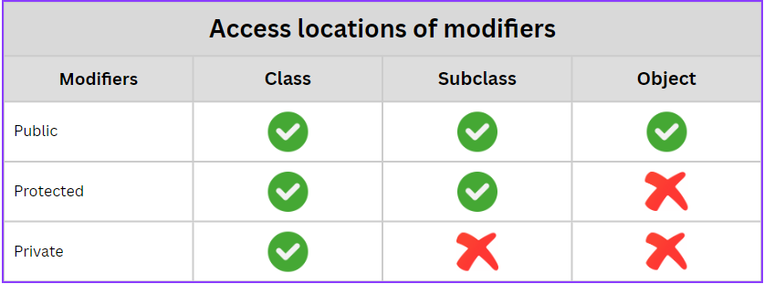

# Encapsulation
Encapsulation is another core principle of object-oriented programming (OOP) that involves bundling the data (attributes) and methods (functions) that operate on the data into a single unit called a class. It allows you to hide the internal state of an object from the outside world and only expose what is necessary, thereby protecting the integrity of the data and ensuring that it is accessed and modified in a controlled manner.

# Advantage
Access Control: You can control the access level to certain parts of an object. For example, some attributes may be private (accessible only within the class), while others may be public (accessible from outside the class).

# Access Modifier
Access modifiers are keywords used in object-oriented programming languages like TypeScript, Java, C#, and others to control the visibility and accessibility of class members (attributes and methods). They specify the level of access that other classes or components have to a particular class member.

## Types of Access Modifiers:

### Public (public):
- Members are accessible from anywhere, both within the same class and from outside the class.
- There are no restrictions on accessing public members.

### Private (private):

- Members are accessible only within the class where they are defined.
- They cannot be accessed or modified from outside the class, not even from subclasses.

### Protected (protected):
- Members are accessible within the class where they are defined and in subclasses (derived classes).
- They cannot be accessed from outside the class or its subclasses.

